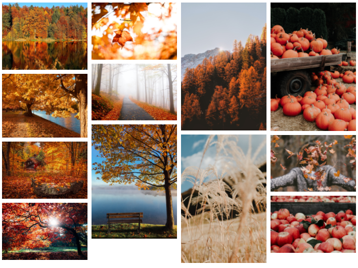

# Cvičení: Npmjs galerie

Za úkol máš nakódovat design podle grafického návrhu.



- Obrázky vyskládej do takzvaného `masonry` rozložení pomocí balíčku [@appnest/masonry-layout](https://www.npmjs.com/package/@appnest/masonry-layout).

  - V první řadě budeš muset balíček do stránky napojit. Nejjednodušeji tak, že před zavírací značku `</body>` vložíš tento skript:

    ```html
    <script src="https://unpkg.com/@appnest/masonry-layout/umd/masonry-layout.min.js"></script>
    ```

  - Nastav `<masonry-layout>` pomocí `gap` atributu tak, aby mezi obrázky byla mezera `8` pixelů.

  - Maximální šířku celé galerie nastav v CSS na `700px`.

  - Zajisti, aby na větších obrazovkách bylo po levé i pravé straně galerie stejně bílého místa. Vytřeď tedy galerii po horizontální, x-ové ose.

  - Šířku jednotlivých sloupců omez na maximálních `200` pixelů pomocí `maxColWidth`.

## Bonus

- Umožni uživateli rozkliknout jednotlivé fotky do detailu přes celou obrazovku pomocí [fslightbox](https://www.npmjs.com/package/fslightbox).

  - Přes tlačítko [Download](https://fslightbox.com/javascript/download) stáhni ZIP archiv se souborem `fslightbox.js`.

  - ZIP rozbal a `fslightbox.js` přesuň do složky s úkolem.

  - Skript zapoj do stránky přidáním `<script src="fslightbox.js"></script>`.

  - Jednotlivé obrázky obal značkou `<a>` s atributem `data-fslightbox` podle [dokumentace](https://fslightbox.com/javascript/documentation/how-to-use). Do adresy `href` dej stejnou cestu jako je v `src`. V ideálním případě bychom měli každý obrázek aspoň ve dvou velikostech. Menší by se používala v `src` pro zobrazení v mřížce, kde jsou jen náhledy obrázků. Do `href` by pak přišla větší varianta, kterou fslightbox stáhne, až když uživatel obrázek rozklikne do detailu. Tentokrát optimalizaci pro zjednodušení vynecháme.

- Vyzkoušej, že na jednotlivé obrázky lze kliknout a že se stránka zatmaví se zvětšeným obrázkem.

- Dej si pozor, aby ti mezi obrázky pod a nad nevznikla větší mezera než `8` pixelů. Možná budeš muset opět sáhnout do CSS.
